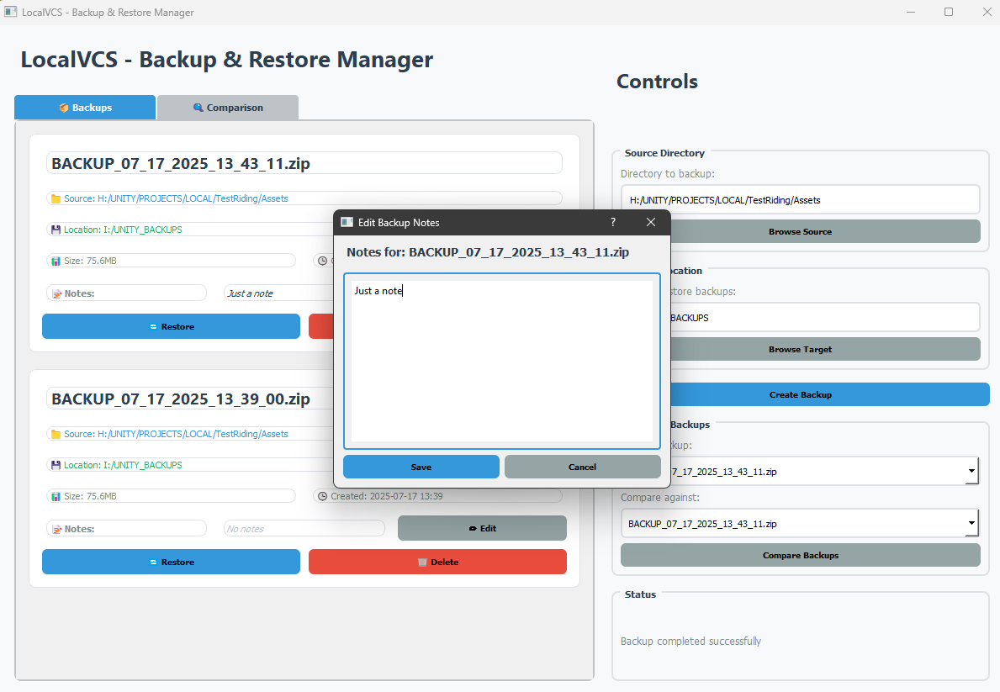
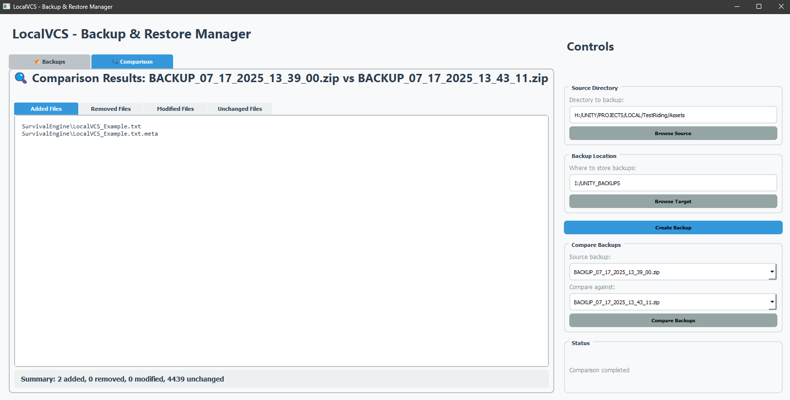
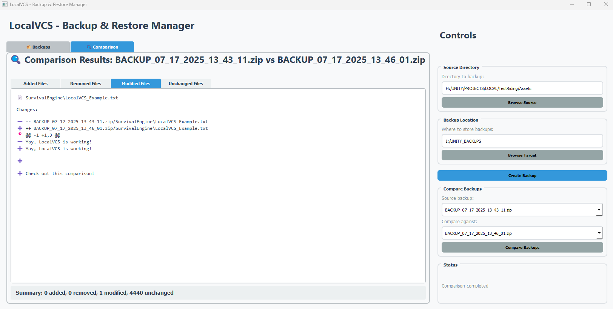
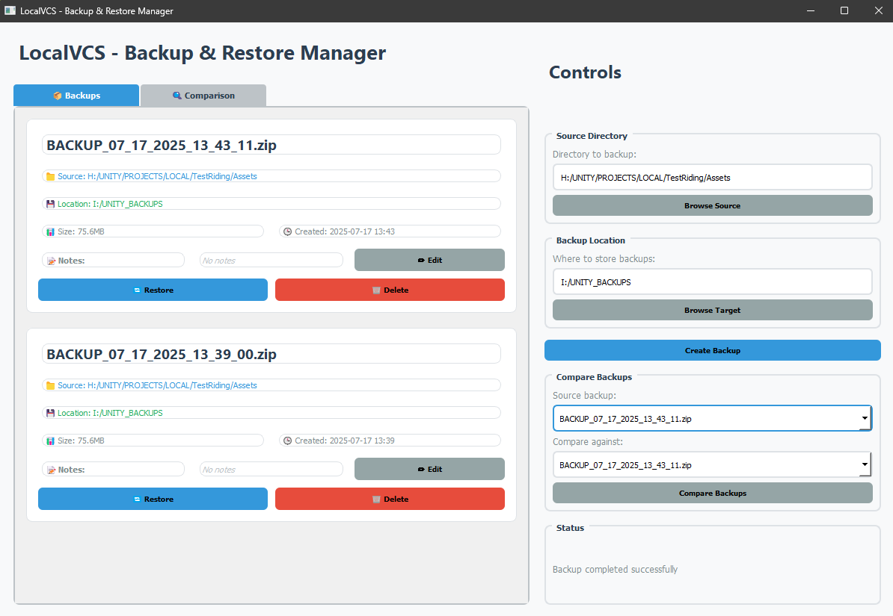

# LocalVCS - Backup & Restore Manager

A powerful, user-friendly backup and restore management system built with Python and PyQt5. LocalVCS provides comprehensive file backup, restore, comparison, and version control capabilities with an intuitive graphical interface.

## 🚀 Features

- **📦 Automated Backups**: Create timestamped backups of entire directories
- **🔄 One-Click Restore**: Restore files to their original location with ease
- **🔍 Smart Comparison**: Compare different backup versions to see what changed
- **📝 Backup Notes**: Add custom notes to each backup for better organization
- **🔐 MD5 Hash Verification**: Ensures data integrity and enables fast comparison
- **🎨 Modern GUI**: Clean, intuitive interface with tabbed organization
- **⚡ Multi-threaded Operations**: Non-blocking backup/restore operations
- **📊 Detailed File Analysis**: View added, removed, modified, and unchanged files
- **🔧 Configuration Persistence**: Remembers your source and target directories

## 📋 Requirements

- Windows 10/11
- Python 3.7 or higher
- PyQt5

## 🛠️ Installation

### Step 1: Install Python Dependencies

Open Command Prompt or PowerShell and navigate to the project directory:

```cmd
cd "path\to\RandomPythonScripts"
```

Install the required dependencies:

```cmd
pip install -r requirements.txt
```

This will install PyQt5, which is the only external dependency required.

### Step 2: Run the Application

```cmd
python LocalVCS.py
```

## 🎯 How to Use

### Initial Setup

1. **Launch the Application**: Run `python LocalVCS.py`
2. **Set Source Directory**: Click "Browse Source" to select the folder you want to backup
3. **Set Backup Location**: Click "Browse Target" to choose where backups will be stored
4. **Create Your First Backup**: Click "Create Backup" to make your initial backup

### Creating Backups

1. **Select Source**: Choose the directory you want to backup
2. **Select Target**: Choose where to store your backups
3. **Click "Create Backup"**: The system will:
   - Create a timestamped ZIP file (e.g., `BACKUP_12_25_2024_14_30_45.zip`)
   - Generate MD5 hashes for all files
   - Save metadata including file counts and source directory
   - Display the backup in the main interface

### Managing Backups

Each backup appears as a card showing:
- **Backup Name**: Timestamp-based identifier
- **Source Directory**: Original folder that was backed up
- **Backup Location**: Where the backup file is stored
- **File Size**: Compressed size of the backup
- **Creation Date**: When the backup was made
- **Notes**: Custom notes you can add/edit

### Adding Notes to Backups



1. Click the "✏️ Edit" button on any backup card
2. Enter your notes in the dialog that appears
3. Click "Save" to store the notes

Notes are useful for remembering what changes were made or why the backup was created.

### Restoring Backups

1. **Select a Backup**: Choose from the list of available backups
2. **Click "🔄 Restore"**: The system will:
   - Confirm the restore operation
   - Extract the backup to the original source directory
   - Replace all existing files (with confirmation)
   - Show a success message when complete

⚠️ **Warning**: Restoring will replace all files in the source directory. Make sure you want to overwrite the current files.

### Comparing Backups

1. **Select Source Backup**: Choose the first backup to compare
2. **Select Compare Backup**: Choose the second backup to compare against
3. **Click "Compare Backups"**: The system will analyze differences and show results

### Understanding Comparison Results

The comparison feature shows results in four tabs:

#### 📦 **Added Files Tab**


- Files that exist in the newer backup but not in the older one
- These are new files that were created

#### 🗑️ **Removed Files Tab**
- Files that exist in the older backup but not in the newer one
- These are files that were deleted

#### 🔄 **Modified Files Tab**


- Files that exist in both backups but have different content
- For `.cs` files, shows detailed line-by-line differences
- For other files, indicates they were modified (binary files don't show diff)

#### ✅ **Unchanged Files Tab**
- Files that are identical in both backups
- These files haven't been modified

### Deleting Backups

1. Click the "🗑️ Delete" button on any backup card
2. Confirm the deletion
3. The backup file, hash file, and notes will all be removed

## 🔐 Understanding MD5 Hash Technology

### What is MD5 Hashing?

MD5 (Message Digest Algorithm 5) is a cryptographic hash function that creates a unique 128-bit "fingerprint" for any file. Think of it like a digital DNA for your files.

### How It Works in LocalVCS

1. **During Backup Creation**:
   - The system reads each file in chunks
   - Calculates an MD5 hash based on the file's content
   - Stores these hashes in a JSON file alongside the backup

2. **During Comparison**:
   - Instead of reading entire files, the system compares the stored hashes
   - If hashes match = files are identical
   - If hashes differ = files have been modified
   - This makes comparison extremely fast, even for large files

### Benefits of MD5 Hashing

- **⚡ Speed**: Comparing hashes is much faster than reading entire files
- **🔒 Integrity**: Ensures files haven't been corrupted
- **📊 Accuracy**: Provides precise detection of file changes
- **💾 Efficiency**: Only needs to read files once during backup creation

### Example Hash
```
File: document.txt
MD5 Hash: d41d8cd98f00b204e9800998ecf8427e
```

If the file content changes, the hash will be completely different, making it easy to detect modifications.

## 🎨 Interface Overview

### Main Window Layout



The application has two main sections:

#### Left Side - Backup Management
- **📦 Backups Tab**: Shows all your backup cards
- **🔍 Comparison Tab**: Displays comparison results when comparing backups

#### Right Side - Controls
- **Source Directory**: Select folder to backup
- **Backup Location**: Choose where to store backups
- **Create Backup**: Start a new backup
- **Compare Backups**: Compare two different backups
- **Status**: Shows current operation progress

### Tab System

#### 📦 Backups Tab
- Displays all backup cards in chronological order
- Each card shows backup details and action buttons
- Scrollable list for many backups

#### 🔍 Comparison Tab
- Shows results when comparing two backups
- Organized into sub-tabs for different file categories
- Detailed diff view for text files

## 🔧 Configuration

The application automatically saves your settings in `backup_config.json`:
- Source directory path
- Target directory path

Settings persist between application launches.

## 📁 File Structure

When you create a backup, the system generates three files:

1. **`BACKUP_MM_DD_YYYY_HH_MM_SS.zip`**: The actual backup file
2. **`BACKUP_MM_DD_YYYY_HH_MM_SS_hashes.json`**: MD5 hashes and metadata
3. **`BACKUP_MM_DD_YYYY_HH_MM_SS_notes.txt`**: Your custom notes (if any)

## 🚨 Troubleshooting

### Common Issues

**"PyQt5 not found"**
```cmd
pip install PyQt5>=5.15.0
```

**"Permission denied"**
- Run Command Prompt as Administrator
- Ensure you have write permissions to the target directory

**"Source directory does not exist"**
- Verify the source directory path is correct
- Use the "Browse Source" button to select the directory

**"Backup failed"**
- Check available disk space
- Ensure the target directory is writable
- Verify the source directory contains files

### Performance Tips

- **Large Directories**: The application handles large directories well, but initial backup creation may take time
- **Frequent Backups**: Consider the frequency of backups based on your needs
- **Storage Space**: Monitor your backup location for available space

## 🔄 Version Control Features

LocalVCS provides version control capabilities:

- **Incremental Tracking**: Each backup represents a point-in-time snapshot
- **Change Detection**: Easily see what changed between versions
- **Rollback Capability**: Restore to any previous backup
- **Change History**: Track file additions, deletions, and modifications

## 📈 Best Practices

1. **Regular Backups**: Create backups before making significant changes
2. **Meaningful Notes**: Add descriptive notes to important backups
3. **Organized Storage**: Use a dedicated folder for your backups
4. **Periodic Cleanup**: Delete old backups to save space
5. **Test Restores**: Occasionally test restore functionality

## 🤝 Support

If you encounter issues:
1. Check the troubleshooting section above
2. Verify all dependencies are installed
3. Ensure you have proper permissions
4. Check available disk space

## 👨‍💻 Author

**KrolPower**

## 📄 License

This project is open source and available under the MIT License.

---

**LocalVCS** - Your reliable companion for file backup and version control on Windows! 🚀